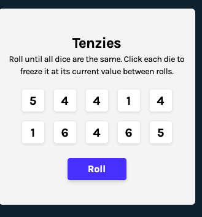

# Tenzies

A version of the game tenzies created using Create React App and TypeScript.

A project for [Scrimba's Learn React for Free course](https://scrimba.com/learn/learnreact/). Design by Scrimba. All code is my own.

# Technologies Used

- [React](https://reactjs.org/)
- [Create React App](https://create-react-app.dev/)
- [TypeScript](https://www.typescriptlang.org/)
- [Tailwind CSS](https://tailwindcss.com/)
- [react-confetti](https://github.com/alampros/react-confetti#readme)

# Reflection

Overall, I found this to be quite a simple project. I decided to use TypeScript and Tailwind CSS to up the challenge a little bit, and to continue to improve my skills in those technologies.

# Installation and Setup

Clone down this repository. You will need node and npm installed globally on your machine.

Installation:

`npm install`

To Start Server:

`npm start`

To Visit App:

`localhost:3000`

# Contact

[Andrew Huntington](https://andrewhuntington.com)
